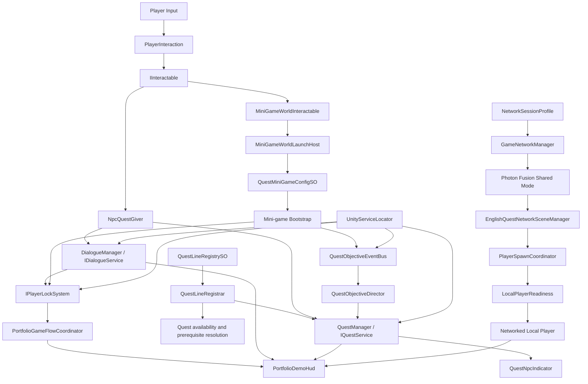

# English Quest Online - Architecture

## Purpose

This document explains the runtime architecture of the current portfolio slice.

The project is intentionally scoped as a small vertical slice:

- one open-world scene;
- three quest-driven NPC lessons;
- three educational mini-games;
- Photon Fusion Shared Mode for two-player presence;
- independent player progression;
- scene-authored presentation and HUD composition.

This is not written as an abstract design ideal. It describes the actual working architecture of the current repository.

## Architectural goals

The slice is built around a few practical goals:

1. keep the lesson flow readable;
2. keep scene wiring explicit;
3. avoid monolithic manager code;
4. separate content authoring from runtime progression;
5. support multiplayer without making a second player mandatory;
6. keep UI authorable in the scene instead of constructing important hierarchy through hidden runtime logic.

## Applied principles in this slice

This project does use recognizable architectural principles, but only where they solve a real problem in the slice.

- **Limited Service Locator boundary**  
  `UnityServiceLocator` is used as a composition boundary for decoupled runtime contracts. It is intentionally not the default dependency mechanism for authored scene content.

- **Data-driven authoring**  
  Quest lines, lesson order, mini-game bindings, and parts of dialogue flow are authored through `ScriptableObject` data so progression rules stay explicit and editable.

- **Single responsibility**  
  Quest progression, dialogue, HUD presentation, player locking, and multiplayer spawning are handled by separate runtime systems with narrow responsibilities.

- **Event-driven progression**  
  Mini-games report results through the objective event pipeline instead of mutating quest state directly.

- **Explicit composition root**  
  The main runtime anchors remain visible in the scene hierarchy so setup and debugging stay practical.

- **Scene-authored presentation**  
  Important UI structure lives in the scene and referenced prefabs, while runtime code binds state and behavior instead of rebuilding the interface.

- **Additive multiplayer**  
  Multiplayer is integrated as a system layer that supports the slice without redefining the solo-first learning flow.

- **Validation-first maintenance**  
  Editor tools and validators are treated as part of the architecture because they reduce authoring risk and keep the slice safer to extend.

## Runtime layers

The portfolio scene is composed from six cooperating layers:

1. **Open-world interaction layer**
2. **Dialogue layer**
3. **Quest progression layer**
4. **Mini-game integration layer**
5. **Multiplayer layer**
6. **Portfolio presentation and validation layer**

Each layer owns a narrow responsibility and communicates through interfaces, authored data, explicit scene references, or event transport.

## Composition root

Primary scene:

`Assets/_PortfolioSlice/Demo/Scenes/PortfolioDemo.unity`

Core runtime anchors visible in the scene:

- `Quest Manager`
- `Quest Line Registrar`
- `Dialogue Manager`
- `Quest Objective Event Bus`
- `Portfolio Demo HUD`
- `Network`

These objects form the composition root of the slice. Player objects, NPCs, mini-game stations, and HUD elements are intentionally wired around them.

## Runtime flow at a glance

## Service boundary

The project uses `UnityServiceLocator` as a controlled composition boundary.

Why it exists:

- scene systems can publish shared runtime contracts once;
- gameplay components avoid hard singleton dependencies;
- multiplayer and local systems can resolve the correct local services per runtime context;
- inspector-based authoring can remain explicit without forcing every dependency through giant serialized graphs.

Typical runtime contracts resolved through the locator:

- `IQuestService`
- `IDialogueService`
- `IQuestObjectiveEventBus`
- player lock/input control services
- local player readiness and session helpers

Important rule:

The Service Locator is not the default answer for every dependency. Explicit scene references and ScriptableObject references are still preferred whenever the dependency is part of authored setup.

In practice, the slice uses three dependency styles together:

- ScriptableObject authoring for lessons, quests, and mini-game content
- explicit scene references for authored UI and composition-root objects
- service resolution for runtime contracts that must remain decoupled across scene and network contexts

## Quest architecture

Core quest files:

- `Scripts/Core/QuestSystem/Core/QuestManager.cs`
- `Scripts/Core/QuestSystem/Authoring/QuestLineSO.cs`
- `Scripts/Core/QuestSystem/Authoring/QuestLineRegistrar.cs`
- `Scripts/Core/QuestSystem/Core/QuestInfo.cs`

### Responsibilities

#### `QuestLineSO`

Defines one authored quest line:

- NPC identity
- display metadata
- prerequisite line
- ordered quest references

#### `QuestLineRegistrar`

Registers authored quest-line data into runtime quest services and resolves prerequisite relationships.

#### `QuestManager`

Acts as the authoritative local progression service for the current player:

- starts quests
- tracks current state
- advances objectives
- completes quests
- emits progression events

### Why the quest model matters

The portfolio slice depends on quest gating for the learning order:

- Ada must unlock first
- Ben must stay closed until Ada completes
- Nora must stay closed until Ben completes

That order is authored in data, not embedded in scene-specific conditionals.

## Dialogue and interaction

Core files:

- `Scripts/Core/Dialogue/DialogueManager.cs`
- `Scripts/Core/Player/PlayerInteraction.cs`
- `Scripts/Core/Player/PlayerInteractionController.cs`
- `Scripts/Core/InteractionSystem/Scripts/IInteractable.cs`

NPCs and mini-game stations share the same interaction contract.

Practical flow:

1. player enters range of an interactable;
2. the current interaction prompt becomes available;
3. interaction opens either dialogue or an activity;
4. player movement/input is locked when required;
5. cursor state switches to match the active UX mode;
6. closing the activity returns the player to open-world control.

This avoids duplicated interaction logic for NPCs versus gameplay stations.

## Flow control and player locking

Core files in this area:

- `Scripts/PortfolioDemo/PortfolioGameFlowCoordinator.cs`
- `Scripts/PortfolioDemo/PortfolioDemoHud.cs`
- player lock implementations resolved through `IPlayerLockSystem`

This layer is one of the most important parts of the slice because it keeps control ownership valid across:

- world movement
- dialogue interaction
- mini-game takeover
- final completion state

Without it, the right systems would still exist, but they would fight each other for:

- movement control
- cursor ownership
- HUD visibility
- completion panel priority

This is why flow control is intentionally kept outside quest content and outside individual mini-games.

## Objective event model

Mini-games do not mutate quest state directly.

Instead:

1. a mini-game completes;
2. it publishes an objective event;
3. `QuestObjectiveDirector` interprets the event;
4. `QuestManager` updates only the matching active objective;
5. the next valid NPC or station becomes available.

This keeps:

- mini-game runtime logic independent;
- quest progression centralized;
- debug and validation tooling easier to reason about.

## Mini-game integration

The current slice integrates:

- **Line Match**
- **Letter Ordering**
- **Word Ordering**

These games are not opened directly from random scene code. The world layer uses a stable launch path:

- `MiniGameWorldInteractable`
- `MiniGameWorldLaunchHost`
- `QuestMiniGameConfigSO`
- mini-game bootstrap

### Shared lifecycle expectations

Each mini-game is expected to behave consistently:

- open from a world station;
- acquire player/UI control cleanly;
- use its own scene-authored visual hierarchy;
- report completion through the same integration boundary;
- release control cleanly;
- optionally show completion feedback before returning to the world.

This gives the slice a unified mini-game contract even though the gameplay itself differs.

## HUD and presentation architecture

The project moved away from "magic" HUD creation and toward scene-driven presentation.

### Current rule

Important UI structure should already exist in the scene or in referenced prefabs.

That includes:

- header card
- mission briefing
- multiplayer player panel
- dialogue panel
- completion panel

### Materialization workflow

The editor tool:

`Tools > English Quest > UI > Materialize Portfolio HUD Prefabs`

is there to:

- sync the current scene-authored HUD structure into prefab assets;
- rewire known references safely;
- preserve editable UI hierarchy as the visual source of truth.

It is not meant to hide or regenerate the entire interface during gameplay.

### Why this matters

For portfolio and production collaboration alike, hand-tuned UI should stay inspectable:

- designers can edit layout directly in the hierarchy;
- engineers can wire logic without rebuilding visuals in code;
- prefab outputs remain consistent with the scene source.

The current presentation model is intentionally split:

- the scene owns structure and visual tuning
- prefabs store reusable outputs of that authored UI
- runtime code binds state and behavior, but should not recreate important interface structure

## Portfolio game flow coordinator

The portfolio slice uses explicit high-level flow states rather than scattered UI toggles.

Typical states:

- open world
- dialogue
- mini-game
- level complete

The flow layer is responsible for:

- hiding open-world HUD during mini-games;
- restoring it afterwards;
- keeping final completion flow readable;
- preventing cursor/input conflicts between world control and UI control.

It also acts as the bridge between domain progress and presentation state:

- quest completion changes what the player is allowed to do next
- dialogue can suspend movement safely
- mini-games can temporarily take over the screen
- level completion can present an ending state without leaving the player half-locked in gameplay

## Multiplayer architecture

Core multiplayer mode:

- Photon Fusion `GameMode.Shared`

Main files and responsibilities:

- `GameNetworkManager` - starts and manages the network session
- `EnglishQuestNetworkSceneManager` - scene/session integration
- `PlayerSpawnCoordinator` - spawns players at authored spawn points
- `NetworkStarterAssetsPlayer` - binds network ownership to local playable character behavior
- `LocalPlayerReadiness` - publishes when the local player is actually ready for scene-level systems
- `PlayerQuestStatusSync` - exposes lesson/progress state to shared HUD

### Deliberate multiplayer rule

Multiplayer presence is shared, but quest progression is local per player.

This is not a compromise caused by missing implementation. It is the correct rule for this slice because:

- the demo must remain fully valid for a solo reviewer;
- multiplayer should strengthen the presentation, not make the lesson chain fragile;
- ownership is easier to explain and debug when lessons remain player-local.

### What multiplayer currently proves

- two players can join one room;
- both spawn at different points;
- each instance owns its own camera;
- movement authority stays local;
- remote players remain visible and collidable;
- shared presence does not corrupt solo-first quest flow.

The important architectural point is that multiplayer is not only "runner + prefab spawn".
There is a real hand-off chain:

`NetworkSessionProfile -> GameNetworkManager -> EnglishQuestNetworkSceneManager -> PlayerSpawnCoordinator -> LocalPlayerReadiness -> local player ownership -> shared HUD visibility`

That hand-off is what protects the slice from common prototype failures such as:

- wrong camera ownership
- control enabling too early
- stale local-player references
- HUD reading the wrong instance state

## Validation and tooling layer

The slice includes editor-side support so the prototype stays maintainable:

- scene builder
- validation analyzers
- docs menu
- HUD materializer
- progress/debug tools

Key files:

- `Scripts/Editor/PortfolioDemo/PortfolioDemoSceneBuilder.cs`
- `Scripts/Editor/PortfolioDemo/PortfolioDemoValidationAnalyzer.cs`
- `Scripts/Editor/PortfolioDemo/PortfolioHudPrefabMaterializer.cs`
- `Scripts/Editor/PortfolioDemo/PortfolioDemoDocsMenu.cs`

That tooling is part of the architecture, not an afterthought. The point is to make the slice easier to review, easier to reset, and safer to extend.

## Extension rules

When extending the project, keep these boundaries:

### Good extensions

- new quest lines authored through the same data model
- new mini-games integrated through the same launch contract
- stronger validator coverage
- better UI polish using the same scene-authored approach
- additional optional multiplayer presentation

### Risky extensions

- reintroducing runtime-generated UI structure
- bypassing objective events and writing quest state directly from gameplay screens
- putting content rules into scene-only conditionals instead of authored data
- making the second player mandatory for the MVP lesson flow

## Non-goals of the current architecture

This slice does not currently attempt to solve:

- shared party-wide quest ownership
- synchronized dialogue sessions
- production backend progression
- multi-scene world streaming
- full-scale content pipeline automation for a large game

Those can come later. The current architecture is intentionally optimized for clarity, maintainability, and demonstrable technical judgment inside a small slice.
