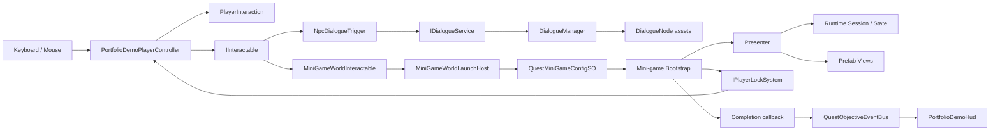
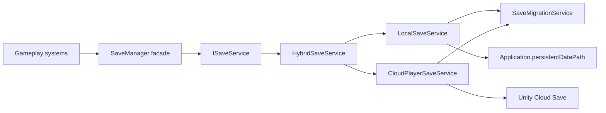

# English Quest Online - Project Map

## Назначение документа

Это основной навигационный документ портфолио-проекта.

Он отвечает на четыре вопроса:

1. Что уже находится в проекте?
2. Какие системы реально подключены к демонстрационной сцене?
3. Где искать код, данные, UI и точки расширения?
4. Что необходимо подключить следующим шагом, не перечитывая весь `SourceMirror`?

Документ описывает состояние проекта после создания интеграционной сцены `PortfolioDemo`.

---

## Быстрый старт

### Unity

- Версия редактора: `Unity 6000.3.3f1`
- Render Pipeline: `URP 17.3.0`
- Input: `Unity Input System 1.17.0`
- Основная сцена: `Assets/_PortfolioSlice/Demo/Scenes/PortfolioDemo.unity`
- Генератор сцены: `Tools > Portfolio Demo > Rebuild Test Scene`

### Управление в PortfolioDemo

- `WASD` - движение капсулы
- `E` - взаимодействие с ближайшим объектом
- Mouse - кнопки диалога и UI мини-игр

### Что проверяет сцена

- локальное движение игрока
- единый контракт `IInteractable`
- поиск ближайшего интерактивного объекта
- Service Locator
- блокировку управления при открытии gameplay UI
- разговор с NPC через `DialogueNode`
- запуск Line Match
- запуск Letter Ordering
- запуск Word Ordering
- публикацию события о завершении мини-игры
- корректное закрытие UI и возврат управления игроку

### Что сцена пока не проверяет

- запуск Photon Fusion session
- сетевой spawn игрока
- синхронизацию диалога или мини-игр между клиентами
- полноценную последовательность `QuestManager`
- восстановление quest progress после перезапуска
- `SaveSystemBootstrapper` и реальную запись demo-прогресса

---

## Карта верхнего уровня

```text
English Quest online/
|-- Assets/
|   |-- _PortfolioSlice/        Главный авторский портфолио-срез
|   |-- _ThirdParty/            Сторонние плагины и Fusion-related vendor content
|   |-- Photon/                 Photon SDK
|   |-- Scenes/                 Unity template SampleScene, не основная сцена
|   |-- Settings/               Настройки стандартного Unity template
|   |-- TextMesh Pro/           TMP Essential Resources
|   `-- TutorialInfo/           Unity template tutorial assets
|-- Packages/
|   |-- manifest.json           UPM-зависимости
|   `-- packages-lock.json      Зафиксированные версии пакетов
|-- ProjectSettings/            Unity project settings и Build Settings
`-- Library/                    Генерируемый Unity cache, не является исходным кодом
```

### Главное правило навигации

Авторская работа для портфолио начинается с:

```text
Assets/_PortfolioSlice
```

`Assets/_ThirdParty` и `Assets/Photon` являются зависимостями. Их не следует использовать как место для нового gameplay-кода.

---

## Карта PortfolioSlice

```text
Assets/_PortfolioSlice/
|-- Art/
|   |-- Materials/LineMatch/
|   |-- Prefabs/GamePlay/LineMatch/
|   |-- Prefabs/UI/GamePlay/
|   `-- Sprites/LineMatch/
|-- Data/
|   `-- MiniGames/LineMatch/
|-- Demo/
|   |-- Data/
|   |-- Prefabs/
|   `-- Scenes/
|-- Docs/
|-- SourceMirror/
|   `-- _OurAssets/
|       |-- Data/
|       |-- Input/
|       |-- Resources/
|       |-- Scripts/
|       |-- Settings/
|       `-- _Project.asmdef
|-- Scenes/                     Зарезервировано, сейчас пусто
`-- Scripts/                    Зарезервировано, сейчас пусто
```

### Назначение основных областей

| Область | Назначение | Использовать для новой работы |
|---|---|---|
| `Art` | Перенесённые UI-префабы, sprites и материалы выбранных мини-игр | Да, для визуальной доработки выбранных игр |
| `Data` | Компактные игровые данные вне полного SourceMirror | Да |
| `Demo` | Портфолио-сцена, её тестовые SO и локальные префабы | Да, это текущая точка сборки |
| `Docs` | История процедур и этот архитектурный документ | Да |
| `SourceMirror` | Перенесённый код и данные исходного Teacher Adventure | Только осознанно, после проверки зависимости |
| `_ThirdParty` | Vendor code | Нет |
| `Photon` | Photon SDK | Нет |

---

## Текущий статус систем

| Система | Код перенесён | Подключена в PortfolioDemo | Проверяется сценой | Следующий шаг |
|---|---:|---:|---:|---|
| Service Locator | Да | Да | Да | Использовать как composition boundary |
| Interaction | Да | Да | Да | Сохранить `IInteractable` как единый контракт |
| Dialogue | Да | Да | Да | Заменить тестовый текст контентом |
| Line Match | Да | Да | Да | Переработать визуальный стиль |
| Letter Ordering | Да | Да | Да | Переработать визуальный стиль |
| Word Ordering | Да | Да | Да | Переработать визуальный стиль |
| Quest event bus | Да | Да | Да | Подключить к `QuestObjectiveDirector` |
| Quest Manager | Да | Нет | Нет | Создать портфолио quest definition и bootstrap |
| Quest persistence | Да | Нет | Нет | Подключить после Save System |
| Save System | Да | Нет | Нет | Добавить локальный portfolio bootstrap |
| Photon Fusion | Да | Нет | Нет | Создать отдельную network demo scene |
| Production player | Да | Нет | Нет | Сейчас заменён локальной капсулой |
| Inventory | Нет | Нет | Нет | При необходимости создать новый простой inventory |

---

## Основная сцена

### Файл

```text
Assets/_PortfolioSlice/Demo/Scenes/PortfolioDemo.unity
```

Она стоит первой в:

```text
ProjectSettings/EditorBuildSettings.asset
```

В Build Settings также остаётся template-сцена:

```text
Assets/Scenes/SampleScene.unity
```

Она не является частью текущего portfolio flow.

### Логическая иерархия PortfolioDemo

```text
PortfolioDemo
|-- Directional Light
|-- Demo Ground
|-- Boundary x3
|-- Main Camera
|-- EventSystem
|-- Service Locator Global
|-- Quest Objective Event Bus
|-- Dialogue Canvas
|-- Dialogue Manager
|-- Portfolio Demo HUD
|-- Player Capsule
|-- NPC - Teacher Ada
|-- UI - Line Match
|-- UI - Letter Ordering
|-- UI - Word Ordering
|-- Line Match Station
|-- Letter Ordering Station
`-- Word Ordering Station
```

### Автоматическая пересборка

```text
Tools > Portfolio Demo > Rebuild Test Scene
```

Код:

```text
Assets/_PortfolioSlice/SourceMirror/_OurAssets/Scripts/Editor/PortfolioDemo/PortfolioDemoSceneBuilder.cs
```

Builder создаёт:

- окружение из primitives
- камеру и свет
- капсулу игрока
- NPC Teacher Ada
- dialogue UI
- HUD
- EventSystem с `InputSystemUIInputModule`
- `ServiceLocatorGlobal`
- `QuestObjectiveEventBus`
- три станции мини-игр
- три gameplay UI prefab instance
- demo ScriptableObjects
- запись сцены в Build Settings

После ручного изменения сгенерированной сцены нужно помнить: повторный `Rebuild Test Scene` может перезаписать scene wiring. Постоянные изменения следует вносить в builder или в отдельные префабы.

---

## Архитектура активного demo-контура



### Главная архитектурная идея

Мир не открывает конкретный UI напрямую.

Станция знает только:

- стабильный `gameId`
- `MiniGameWorldLaunchHost`
- `QuestMiniGameConfigSO`

Конкретный config выбирает нужный bootstrap и передаёт ему content asset. Благодаря этому world interaction, quest binding и реализация мини-игры остаются разделены.

---

## Service Locator

### Расположение

```text
Assets/_PortfolioSlice/SourceMirror/_OurAssets/Scripts/Core/Patterns/ServiceLocator/
```

### Ключевые файлы

| Файл | Ответственность |
|---|---|
| `ServiceLocator.cs` | Контейнер, поиск global/scene/hierarchy scope, register/resolve |
| `Bootstrapper.cs` | Общий lifecycle bootstrap-компонентов |
| `ServiceLocatorGlobal.cs` | Создаёт global container, опционально `DontDestroyOnLoad` |
| `ServiceLocatorScene.cs` | Scene-scoped container |
| `ServiceManager.cs` | Управление сервисами |

### Сервисы активной сцены

| Контракт | Реализация в PortfolioDemo | Кто регистрирует |
|---|---|---|
| `IPlayerLockSystem` | `PortfolioPlayerLockService` | Player Capsule |
| `IDialogueService` | `DialogueManager` | Dialogue Manager |
| `IQuestObjectiveEventBus` | `QuestObjectiveEventBus` | Quest Objective Event Bus |

### Правило использования

Использовать Service Locator для scene/runtime infrastructure, которую невозможно удобно передать через Inspector:

- player lock
- dialogue service
- quest service
- save service
- objective event bus

Обычные view references, prefab references и ScriptableObjects предпочтительно передавать через Inspector.

Не следует превращать Service Locator в замену всем зависимостям.

---

## Interaction System

### Ключевые файлы

```text
Scripts/Core/InteractionSystem/Scripts/IInteractable.cs
Scripts/Core/InteractionSystem/Scripts/PlayerInteraction.cs
Scripts/Core/InteractionSystem/Scripts/Interactions/NpcDialogueTrigger.cs
Scripts/Core/QuestSystem/Objectives/Markers/MiniGameWorldInteractable.cs
Scripts/PortfolioDemo/PortfolioDemoPlayerController.cs
```

### Контракт

```csharp
public interface IInteractable
{
    string InteractionPrompt { get; }
    bool CanInteract { get; }
    bool Interact(PlayerInteraction interactor);
}
```

### Demo flow

1. `PortfolioDemoPlayerController` выполняет `Physics.OverlapSphereNonAlloc`.
2. Компоненты приводятся к `IInteractable`.
3. Выбирается ближайший доступный объект.
4. Prompt передаётся в `PortfolioDemoHud`.
5. По `E` вызывается `Interact(PlayerInteraction)`.

### Почему используется локальный controller

`PlayerInteraction` является `Fusion.NetworkBehaviour`, потому что он пришёл из сетевой production-архитектуры.

В demo-сцене нет запущенного `NetworkRunner`. Поэтому:

- movement и чтение клавиатуры выполняет `PortfolioDemoPlayerController`
- `PlayerInteraction` используется как общий interaction context
- сетевой `PlayerLockSystem` заменён на `PortfolioPlayerLockService`

Это adapter, а не новая параллельная gameplay-архитектура.

---

## Player Lock

### Production contract

```text
Scripts/Core/Player/Network/IPlayerLockSystem.cs
Scripts/Core/Player/Network/PlayerLockSystem.cs
```

Типы блокировок:

- `Movement`
- `Camera`
- `Interaction`
- `Cursor`
- `GameplayInput`

### Demo adapter

```text
Scripts/PortfolioDemo/PortfolioPlayerLockService.cs
```

Он реализует тот же `IPlayerLockSystem`, но управляет локальной капсулой вместо Fusion player.

`GameplayUIBase` запрашивает `IPlayerLockSystem` через Service Locator. Поэтому диалоговые и игровые UI не должны знать, используется local demo player или network player.

---

## Dialogue System

### Расположение

```text
Assets/_PortfolioSlice/SourceMirror/_OurAssets/Scripts/Core/Dialogue/
```

### Ключевые элементы

| Элемент | Ответственность |
|---|---|
| `DialogueNode` | ScriptableObject с speaker, text, voice, action и choices |
| `DialogueChoice` | Текст выбора и ссылка на следующий node |
| `IDialogueService` | Контракт запуска диалога |
| `DialogueManager` | Обычный UI dialogue runtime |
| `CinematicDialogueManager` | Альтернативное cinematic presentation |
| `TextTyper` | Эффект печати текста |
| `DialogueLockListener` | Реакция на начало/конец диалога |

### Demo content

```text
Assets/_PortfolioSlice/Demo/Data/Dialogue_Teacher_Start.asset
Assets/_PortfolioSlice/Demo/Data/Dialogue_Teacher_Systems.asset
Assets/_PortfolioSlice/Demo/Prefabs/DialogueChoiceButton.prefab
```

### Поток

```text
Player presses E
-> NpcDialogueTrigger.Interact
-> ServiceLocator resolves IDialogueService
-> DialogueManager.StartDialogue
-> DialogueNode is displayed
-> player lock is applied
-> choice selects next DialogueNode
-> dialogue ends
-> player lock is released
```

### Точка расширения

Чтобы создать нового NPC:

1. Создать один или несколько `DialogueNode`.
2. Связать choices ссылками на следующие nodes.
3. Добавить `NpcDialogueTrigger` на NPC.
4. Передать первый node в `startingNode`.
5. Убедиться, что в сцене зарегистрирован `IDialogueService`.

---

## Mini-game Integration Layer

### World-side classes

```text
Scripts/Core/QuestSystem/Objectives/Markers/MiniGameWorldInteractable.cs
Scripts/Core/QuestSystem/Objectives/Markers/MiniGameWorldLaunchHost.cs
```

### Config-side classes

```text
Scripts/Core/QuestSystem/Objectives/MiniGames/QuestMiniGameConfigSO.cs
Scripts/Core/QuestSystem/Objectives/MiniGames/LineMatchQuestConfigSO.cs
Scripts/Core/QuestSystem/Objectives/MiniGames/LetterOrderingQuestConfigSO.cs
Scripts/Core/QuestSystem/Objectives/MiniGames/WordOrderingQuestConfigSO.cs
```

### Quest binding

```text
Scripts/Core/QuestSystem/Objectives/MiniGames/IQuestMiniGameBinder.cs
Scripts/Core/QuestSystem/Objectives/MiniGames/QuestMiniGameBinder.cs
```

`QuestMiniGameBinder` может подставлять config активного quest objective по `gameId`.

В `PortfolioDemo` полноценный quest binder не зарегистрирован. Поэтому станции используют `fallbackConfig` из `MiniGameWorldLaunchHost`. Это осознанный standalone/debug path.

### Стабильные gameId

| Игра | gameId | Config asset |
|---|---|---|
| Line Match | `line_match` | `Demo/Data/LineMatchQuestConfig.asset` |
| Letter Ordering | `letter_ordering` | `Demo/Data/LetterOrderingQuestConfig.asset` |
| Word Ordering | `word_ordering` | `Demo/Data/WordOrderingQuestConfig.asset` |

`gameId` должен совпадать в:

- `MiniGameWorldInteractable`
- `QuestMiniGameConfigSO`
- quest objective `targetId`, когда будет подключён полноценный quest

---

## Line Match

### Механика

Игрок соединяет букву с подходящим словом или изображением, протягивая линию. Упражнение заканчивается, когда все word slots заполнены корректными буквами.

### Код

```text
Scripts/GamePlay/MiniGames/LineMatch/
|-- Bootstrap/
|-- Data/
|-- Factories/
|-- Presentation/
|-- Services/
|-- State/
|-- Utilities/
`-- Views/
```

### Основные классы

| Слой | Класс | Ответственность |
|---|---|---|
| Bootstrap | `LetterConnectionBootstrap` | Lifecycle, player lock, callbacks |
| Data | `LetterConnectionLevelConfigSO` | Content definition |
| State | `LevelSession` | Runtime session |
| State | `LetterState`, `WordSlotState` | Runtime state отдельных элементов |
| Validation | `ExactLetterValidationStrategy` | Проверка соединения |
| Completion | `AllWordsFilledCompletionChecker` | Проверка окончания уровня |
| Presentation | `LetterConnectionPresenter` | Координация state и views |
| Factory | `LetterConnectionViewFactory` | Создание UI элементов |
| Views | `LetterItemView`, `WordSlotView`, `ConnectionLineView` | UI representation |

### Данные и визуалы

```text
Assets/_PortfolioSlice/Data/MiniGames/LineMatch/Letters_A_B.asset
Assets/_PortfolioSlice/Art/Prefabs/GamePlay/LineMatch/
Assets/_PortfolioSlice/Art/Sprites/LineMatch/
Assets/_PortfolioSlice/Art/Materials/LineMatch/
```

### Completion flow

```text
AllWordsFilledCompletionChecker
-> LetterConnectionPresenter.LevelCompleted
-> LetterConnectionBootstrap callback
-> MiniGameWorldInteractable.OnGameCompleted
-> QuestObjectiveEventBus.MiniGameCompleted
```

---

## Letter Ordering и Word Ordering

Обе игры используют одно общее ядро `DuolingoWordGame`.

### Механики

Letter Ordering:

- игрок расставляет отдельные буквы
- результат должен образовать правильное слово

Word Ordering:

- игрок расставляет слова
- результат должен образовать правильное предложение или фразу

### Код

```text
Scripts/GamePlay/MiniGames/DuolingoWordGame/
|-- Bootstrap/
|-- Data/
|-- Factory/
|-- Modes/
|-- Presentation/
|-- QuestStep/
|-- State/
|-- Validation/
`-- Views/
```

### Общие классы

| Слой | Класс | Ответственность |
|---|---|---|
| Bootstrap | `WordGameBootstrap` | Создание session/presenter, player lock, callbacks |
| Mode contract | `IWordGameMode` | Подготовка prompt, slots и tiles |
| Mode | `LetterOrderingMode` | Адаптация letter data к общему runtime |
| Mode | `WordOrderingMode` | Адаптация word data к общему runtime |
| Data | `LetterOrderingDataSO` | Letter Ordering content |
| Data | `WordOrderingDataSO` | Word Ordering content |
| State | `WordGameSession` | Общий runtime state |
| State | `SlotState`, `TileState` | Состояние slots и draggable tiles |
| Validation | `ExactOrderingValidator` | Проверка точного порядка |
| Presentation | `WordGamePresenter` | Связывает mode/session/view |
| Factory | `WordGameViewFactory` | Создаёт slots и tiles |
| Views | `WordGamePanelView`, `SlotView`, `TileView` | UI |

### UI и data assets

```text
Assets/_PortfolioSlice/Art/Prefabs/UI/GamePlay/MiniGame/WordOrderingGame/
|-- LetterOrderGame.prefab
|-- WordOrderGame.prefab
|-- WordGamePanel.prefab
|-- SlotView.prefab
|-- TileView.prefab
|-- LetterOrderingData.asset
|-- WordOrderingData.asset
`-- WordTranslationDatabase.asset
```

### Почему две игры используют одно ядро

Разница между играми вынесена в strategy/mode layer. Bootstrap, presenter, session, factory, views и validator переиспользуются.

Это один из главных архитектурных примеров для портфолио.

---

## Quest System

### Расположение

```text
Assets/_PortfolioSlice/SourceMirror/_OurAssets/Scripts/Core/QuestSystem/
```

### Основные подсистемы

| Папка | Назначение |
|---|---|
| `Authoring` | Quest definitions, catalogs, quest lines, NPC availability |
| `Core` | `QuestManager`, quest state и quest steps |
| `Objectives` | Objective definitions, event bus, handlers, markers и resolution |
| `FinishActions` | Действия после quest/step completion |
| `StartActions` | Действия при старте quest |
| `Debug` | Debug snapshot и инструменты |

### Центральные классы

| Класс | Роль |
|---|---|
| `QuestManager` | Runtime source of truth для quest state |
| `IQuestService` | Контракт доступа к quest runtime |
| `QuestDefinitionSO` | Authoring definition |
| `QuestInfo` | Runtime quest instance/state |
| `QuestObjectiveDefinition` | Определение objective |
| `QuestObjectiveDirector` | Подписка на события и продвижение objectives |
| `QuestObjectiveEventBus` | Typed event transport |
| `QuestWorldTargetRegistry` | Runtime registry world targets |
| `QuestWorldResolver` | Поиск world target для active objective |
| `QuestProgressPersistence` | Bridge quest state к save system |

### Что используется сейчас

В PortfolioDemo используется:

- `QuestMiniGameConfigSO`
- `MiniGameWorldInteractable`
- `MiniGameWorldLaunchHost`
- `QuestObjectiveEventBus`
- событие `MiniGameCompleted`

Не используется:

- `QuestManager`
- `QuestObjectiveDirector`
- `QuestProgressPersistence`
- quest authoring assets для demo quest line

Таким образом, HUD подтверждает завершение мини-игры, но quest step пока не переводится автоматически в следующее состояние.

### Следующая интеграция

Для полноценного portfolio quest необходимо:

1. Создать компактный `QuestDefinitionSO`.
2. Добавить objective `CompleteMiniGame`.
3. Установить `targetId`, совпадающий с gameId станции.
4. Зарегистрировать `QuestManager` как `IQuestService`.
5. Добавить `QuestObjectiveDirector`.
6. Зарегистрировать `QuestMiniGameBinder`.
7. Подключить `QuestProgressPersistence`.

---

## Save System

### Расположение

```text
Assets/_PortfolioSlice/SourceMirror/_OurAssets/Scripts/Core/SaveSystem/
```

### Архитектура



### Ключевые классы

| Класс | Ответственность |
|---|---|
| `SaveSystemBootstrapper` | Создаёт backends и регистрирует `ISaveService` |
| `SaveManager` | Статический facade для domain save operations |
| `ISaveService` | Async Save/Load/Delete contract |
| `LocalSaveService` | Versioned JSON в `Application.persistentDataPath` |
| `CloudPlayerSaveService` | Unity Cloud Save backend |
| `HybridSaveService` | Local-first save и cloud-first load с fallback |
| `SaveMigrationService` | Последовательное обновление старых save versions |
| `VersionedWrapper<T>` | Envelope с номером версии |

### Data domains

```text
CoreSaveData
ProgressSaveData
SettingsSaveData
CurrencySaveData
AbilitySaveData
QuestProgressEntry
```

### Важный текущий статус

`SaveSystemBootstrapper` не добавлен в `PortfolioDemo`.

Это означает:

- save-код компилируется и имеет Editor tests
- архитектура local/cloud/migration перенесена
- demo-сцена пока не создаёт `ISaveService`
- завершение мини-игр пока не сохраняется между запусками

Для первого portfolio pass рекомендуется подключить local-only composition root, а cloud backend оставить отдельной демонстрацией. Это сделает проверку воспроизводимой без обязательной UGS authentication.

---

## Photon Fusion

### Расположение зависимостей

```text
Assets/Photon/
Assets/_ThirdParty/Fusion/
Assets/_ThirdParty/FusionAddons/
Assets/_ThirdParty/FusionDemos/
Assets/_ThirdParty/FusionMenu/
Assets/_ThirdParty/PhotonLibs/
```

### Где находится авторская Fusion-логика

Она остаётся внутри:

```text
Assets/_PortfolioSlice/SourceMirror/_OurAssets/Scripts/
```

Примеры:

- `PlayerInteraction : NetworkBehaviour`
- production `PlayerLockSystem : NetworkBehaviour`
- network quest actions
- network player movement
- social/session code

### Текущая граница

`PortfolioDemo` является local integration scene и не запускает `NetworkRunner`.

Поэтому она показывает:

- переносимость domain/gameplay UI
- использование общих contracts
- замену сетевой реализации локальным adapter

Она пока не является Photon Fusion showcase scene.

Для портфолио Photon Fusion лучше создать отдельную сцену, где явно видны:

- runner/bootstrap
- host/client lifecycle
- authority
- network spawn
- scene-scoped services
- взаимодействие двух игроков

Не следует усложнять текущую local test scene сетевым lifecycle до завершения quest/save vertical slice.

---

## Assembly Definitions

### Runtime root

```text
Assets/_PortfolioSlice/SourceMirror/_OurAssets/_Project.asmdef
```

Это широкая runtime assembly перенесённого проекта. Она содержит большинство gameplay/core/UI scripts и ссылки на Fusion, UniTask, Input System, Unity Services и другие зависимости.

### Editor

```text
Assets/_PortfolioSlice/SourceMirror/_OurAssets/Scripts/Editor/EnglishKingdom.Editor.asmdef
```

Содержит editor tools, включая `PortfolioDemoSceneBuilder`.

### Logging

```text
Assets/_PortfolioSlice/SourceMirror/_OurAssets/Scripts/Core/Logging/EnglishKingdom.Logging.asmdef
```

Изолирует logging contract/implementation.

### Tests

```text
Scripts/Tests/Common/Tests.Common.asmdef
Scripts/Tests/Editor/Tests.asmdef
Scripts/Tests/RunTime/RunTime.asmdef
```

Tests активируются через `UNITY_INCLUDE_TESTS`.

### Технический долг assembly layout

`_Project.asmdef` всё ещё является очень широкой assembly boundary.

Для текущего portfolio vertical slice это допустимо, потому что приоритетом был безопасный перенос. В дальнейшем можно выделить отдельные assemblies:

- `EnglishKingdom.Core`
- `EnglishKingdom.Interaction`
- `EnglishKingdom.Dialogue`
- `EnglishKingdom.Quests`
- `EnglishKingdom.Save`
- `EnglishKingdom.MiniGames`
- `EnglishKingdom.PortfolioDemo`

Делать это лучше после подключения quest/save scene, чтобы границы основывались на реальном composition flow.

---

## Package Dependencies

Ключевые пакеты из `Packages/manifest.json`:

| Пакет | Использование |
|---|---|
| `com.cysharp.unitask` | Async operations, save/services |
| `com.unity.inputsystem` | Demo player и UI input |
| `com.unity.ugui` | Gameplay UI |
| `com.unity.render-pipelines.universal` | Rendering |
| `com.unity.cinemachine` | Production camera |
| `com.unity.services.core` | UGS initialization |
| `com.unity.services.authentication` | Cloud identity |
| `com.unity.services.cloudsave` | Cloud save backend |
| `com.unity.test-framework` | Editor/runtime tests |
| `com.unity.ai.navigation` | Перенесённые NPC/world systems |
| `com.unity.animation.rigging` | Перенесённый character layer |

Пакет в manifest не означает, что он используется в PortfolioDemo. Многие зависимости нужны широкому `SourceMirror`.

---

## Tests

### Test Runner

```text
Window > General > Test Runner
```

### Полезные группы

Service Locator:

```text
Scripts/Tests/Editor/ServiceLocator/
```

Quest System:

```text
Scripts/Tests/Editor/QuestSystem/
```

Save System:

```text
Scripts/Tests/Editor/SaveSystem/
```

### Наиболее релевантные тесты

- `ServiceLocatorSceneScopeTests`
- `ServiceManagerLifecycleTests`
- `QuestManagerTests`
- `QuestObjectiveManagerTests`
- `QuestWorldResolverTests`
- `QuestWorldTargetRegistrationTimingTests`
- `QuestWorldTargetRegistryTests`
- `LocalSaveServiceTests`
- `HybridSaveServiceTests`
- `SaveMigrationServiceTests`
- `VersionedWrapperTests`

### Текущий пробел

Нет отдельного automated test suite для:

- Line Match presenter/session
- Letter Ordering mode/session
- Word Ordering mode/session
- полного `Interact -> Open -> Complete -> EventBus` integration flow

Сейчас этот контур проверяется сценой вручную.

---

## ScriptableObjects и данные

### Demo-only assets

```text
Assets/_PortfolioSlice/Demo/Data/
```

Содержит:

- Teacher Ada dialogue nodes
- Line Match quest config
- Letter Ordering quest config
- Word Ordering quest config

### Mini-game content

```text
Assets/_PortfolioSlice/Data/MiniGames/
Assets/_PortfolioSlice/Art/Prefabs/UI/GamePlay/MiniGame/WordOrderingGame/
Assets/_PortfolioSlice/SourceMirror/_OurAssets/Data/MiniGames/
```

### Source of truth для demo

Для текущей сцены source of truth:

- три config assets из `Demo/Data`
- `Letters_A_B.asset`
- `LetterOrderingData.asset`
- `WordOrderingData.asset`

Широкие каталоги под `SourceMirror/_OurAssets/Data` являются перенесённым контентом исходной игры и не должны автоматически считаться активным portfolio content.

---

## Что находится в SourceMirror

`SourceMirror` сохранён как staging area перенесённого Teacher Adventure.

Там присутствует больше систем, чем используется в portfolio demo:

- abilities
- audio
- authentication
- camera
- combat
- currency
- dialogue
- health
- interaction
- level
- logging
- networking
- NPC AI
- notebook
- player
- quests
- rewards
- save
- social/session
- stats
- UI
- world travel

Это полезно как источник архитектурных примеров, но не означает, что всё должно войти в финальный portfolio build.

Перед подключением любой системы из `SourceMirror` нужно проверить:

1. Какие asmdef/package references она требует.
2. Есть ли у неё scene bootstrap.
3. Какие ScriptableObjects нужны.
4. Есть ли привязка к старым assets.
5. Есть ли network authority assumptions.
6. Есть ли Editor/runtime tests.

---

## Удалённые и намеренно не перенесённые системы

В ходе очистки были исключены или отвязаны:

- SoftKitty inventory integration
- legacy inventory bridge
- старые ability/combat presentation tails
- Attack Presenter
- Outline dependency
- Phonics-specific interaction tails
- Teacher radial menu dependency
- lipsync package dependency
- устаревшие quest editor inspectors
- устаревшие reward tests
- legacy letter pickup/bike tails

Если новая функция снова требует одну из этих зависимостей, не следует автоматически возвращать старый пакет. Сначала нужно решить, действительно ли он нужен portfolio scope.

---

## Как добавлять новую мини-игру

Использовать существующий integration pattern:

1. Создать domain data ScriptableObject.
2. Создать runtime session/state без зависимости от scene.
3. Создать validator/completion strategy.
4. Создать presenter.
5. Создать views и factory.
6. Создать bootstrap с `Open`, completion и close callbacks.
7. Наследовать UI bootstrap от `GameplayUIBase`, если требуется player lock.
8. Создать новый `QuestMiniGameConfigSO`.
9. Добавить stable `gameId`.
10. Добавить station с `MiniGameWorldInteractable`.
11. Опубликовать `MiniGameCompleted` через существующий flow.
12. Добавить unit tests для session/validator.

World object не должен зависеть от конкретного presenter или view prefab.

---

## Как подключить Quest + Save vertical slice

Рекомендуемый следующий технический этап:

1. Создать `PortfolioQuestBootstrap`.
2. Зарегистрировать `IQuestService`.
3. Добавить `QuestObjectiveDirector`.
4. Создать короткий quest: Talk to Ada -> Complete Line Match -> Complete Letter Ordering -> Complete Word Ordering.
5. Подключить `QuestMiniGameBinder`.
6. Создать local-only `ISaveService` composition.
7. Подключить `QuestProgressPersistence`.
8. Добавить кнопку reset demo progress.
9. Добавить Editor tests для save/restore quest step.
10. После этого отдельно заменить local save composition на hybrid local/cloud.

Такой порядок позволит сначала доказать архитектуру без зависимости от UGS login.

---

## Как подключить Photon Fusion showcase

Рекомендуется отдельная сцена, а не изменение PortfolioDemo:

```text
Assets/_PortfolioSlice/Demo/Scenes/PortfolioNetworkDemo.unity
```

Минимальный scope:

1. Fusion runner bootstrap.
2. Host и client.
3. Network player prefab.
4. Input authority.
5. Scene-scoped Service Locator.
6. Network-aware `PlayerLockSystem`.
7. Один синхронизируемый world interaction.
8. Явное отображение authority/state в HUD.

Mini-game UI может оставаться local, если quest/world completion подтверждается authority owner и реплицируется как событие/состояние.

---

## Правила безопасной работы

### Можно свободно менять

- `Assets/_PortfolioSlice/Demo`
- `Assets/_PortfolioSlice/Art`
- `Assets/_PortfolioSlice/Data`
- `Assets/_PortfolioSlice/Docs`
- `Scripts/PortfolioDemo`
- `Scripts/Editor/PortfolioDemo`

### Менять осторожно

- `Scripts/Core`
- `Scripts/GamePlay/MiniGames`
- `_Project.asmdef`
- `SourceMirror/_OurAssets/Data`

Эти области используются несколькими системами.

### Не менять без необходимости

- `Assets/_ThirdParty`
- `Assets/Photon`
- package source
- generated `Library`

### Никогда не переносить вручную

- `Library`
- `Temp`
- `Logs`
- `obj`

Unity создаст их заново.

---

## Известные ограничения

1. Demo использует primitives и не является финальной визуальной сценой.
2. `SourceMirror` всё ещё содержит больше кода и данных, чем нужно финальному portfolio build.
3. Runtime assembly `_Project` слишком широкая.
4. Quest progression не подключён к текущему EventBus.
5. Save System не bootstrapped в PortfolioDemo.
6. Photon Fusion не запускается в PortfolioDemo.
7. Mini-game integration пока проверяется вручную, без PlayMode integration tests.
8. Template `SampleScene` всё ещё находится в Build Settings второй сценой.
9. Некоторые комментарии исходного перенесённого кода имеют повреждённые Unicode-символы, но это не влияет на компиляцию.

---

## Ключевые файлы по задачам

| Если нужно... | Открыть |
|---|---|
| Пересобрать demo scene | `Scripts/Editor/PortfolioDemo/PortfolioDemoSceneBuilder.cs` |
| Изменить движение/interaction radius | `Scripts/PortfolioDemo/PortfolioDemoPlayerController.cs` |
| Изменить demo player locks | `Scripts/PortfolioDemo/PortfolioPlayerLockService.cs` |
| Изменить demo status HUD | `Scripts/PortfolioDemo/PortfolioDemoHud.cs` |
| Изменить общий interaction contract | `Scripts/Core/InteractionSystem/Scripts/IInteractable.cs` |
| Изменить NPC dialogue interaction | `Scripts/Core/InteractionSystem/Scripts/Interactions/NpcDialogueTrigger.cs` |
| Изменить dialogue runtime | `Scripts/Core/Dialogue/DialogueManager.cs` |
| Изменить Line Match lifecycle | `Scripts/GamePlay/MiniGames/LineMatch/Bootstrap/LetterConnectionBootstrap.cs` |
| Изменить Line Match logic | `Scripts/GamePlay/MiniGames/LineMatch/Presentation/LetterConnectionPresenter.cs` |
| Изменить ordering lifecycle | `Scripts/GamePlay/MiniGames/DuolingoWordGame/Bootstrap/WordGameBootstrap.cs` |
| Изменить ordering logic | `Scripts/GamePlay/MiniGames/DuolingoWordGame/Presentation/WordGamePresenter.cs` |
| Изменить мини-игровой world bridge | `Scripts/Core/QuestSystem/Objectives/Markers/MiniGameWorldInteractable.cs` |
| Изменить quest event transport | `Scripts/Core/QuestSystem/Objectives/Events/QuestObjectiveEventBus.cs` |
| Изменить quest runtime | `Scripts/Core/QuestSystem/Core/QuestManager.cs` |
| Изменить save composition | `Scripts/Core/SaveSystem/SaveSystemBootstrapper.cs` |
| Изменить local save | `Scripts/Core/SaveSystem/ISaveService/LocalSaveService.cs` |
| Изменить Service Locator | `Scripts/Core/Patterns/ServiceLocator/ServiceLocator.cs` |

Все пути в таблице начинаются с:

```text
Assets/_PortfolioSlice/SourceMirror/_OurAssets/
```

---

## История переноса

Пошаговые отчёты находятся в:

```text
Assets/_PortfolioSlice/Docs/Procedure_01_...
...
Assets/_PortfolioSlice/Docs/Procedure_14_...
```

Использовать их для ответа на вопрос «почему файл или зависимость были удалены».

Использовать `PROJECT_MAP.md` для ответа на вопрос «как проект устроен сейчас и где продолжать работу».

---

## Рекомендуемая следующая задача

Текущий local gameplay foundation готов.

Наиболее логичный следующий vertical slice:

```text
Talk to Teacher Ada
-> accept portfolio quest
-> complete Line Match
-> complete Letter Ordering
-> complete Word Ordering
-> save quest completion locally
-> reload scene
-> restore completed state
```

После этого проект будет демонстрировать в одной короткой последовательности:

- Service Locator
- interaction contracts
- dialogue
- quest authoring/runtime
- event-driven objectives
- три архитектурно разделённые мини-игры
- versioned save

Photon Fusion следует показывать следующим отдельным сценарием, чтобы network architecture была понятна сама по себе и не терялась внутри локального UI showcase.
