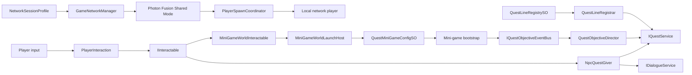

# English Quest Online

A small multiplayer learning prototype built in Unity to demonstrate how an open world, sequential quest lines, educational mini-games, and Photon Fusion can work as one coherent gameplay loop.

This is a portfolio project, not a finished commercial game. The scope is intentionally narrow: one map, three NPCs, three learning stages, and a two-player Shared Mode session. The goal was to build and present the underlying systems clearly rather than hide them behind a large amount of content.

## The idea

The player moves through a compact open world and learns through a sequence of NPC-led lessons:

1. **Teacher Ada** introduces the letters `A` and `B` through a line-matching exercise.
2. **Coach Ben** becomes available after Ada's lesson and asks the player to complete a word by placing the missing letter.
3. **Guide Nora** unlocks last and turns the learned vocabulary into a complete sentence-ordering exercise.

Each NPC owns a separate quest line. A line can declare another line as its prerequisite, so the learning path is enforced by data rather than by hard-coded scene logic. Completed mini-games cannot be started again, and finishing the final lesson completes the current prototype level.

Two players can join the same Photon Fusion room, spawn at separate points, see each other move, and collide in the world. Quest and lesson progress remains individual for each player by design: one player can start or finish a lesson without advancing the other player's learning state.

## What this prototype demonstrates

- a data-driven quest system built with ScriptableObjects;
- sequential NPC and quest-line unlocking;
- a common interaction contract for NPCs and world activities;
- event-driven quest objective updates;
- reusable dialogue and player-input locking;
- three mini-games integrated through a shared launch boundary;
- scoped dependency resolution through a custom Service Locator;
- two-player networking with Photon Fusion Shared Mode;
- network spawning, input authority, camera ownership, movement smoothing, and player collision;
- editor tooling for rebuilding the integration scene;
- Edit Mode and runtime tests around quests, networking, services, player lifecycle, and UI.

## Architecture

The project is organized around small systems with explicit responsibilities. Scene objects communicate through interfaces, ScriptableObject data, and events instead of directly controlling each other's UI or internal state.



### Quest system

Quest content is authored as ScriptableObjects rather than assembled inside MonoBehaviours:

- `QuestLineSO` describes an NPC line, its quests, presentation data, and an optional prerequisite line.
- `QuestLineRegistrySO` is the scene's source of truth for available lines.
- `QuestLineRegistrar` converts authored definitions into runtime quest instances and resolves prerequisite relationships.
- `QuestManager` owns quest state and exposes the quest service used by NPCs, objectives, indicators, and UI.
- `NpcQuestGiver` selects the correct dialogue and action from the current quest state.
- `QuestNpcIndicator` presents the NPC state in the world: locked, available, active, or ready to finish.

The three portfolio quest lines live in:

```text
Assets/_PortfolioSlice/Demo/Data/QuestLines/
|-- 01_TeacherAda_FirstQuestline/
|-- 02_CoachBen_SecondQuestline/
|-- 03_GuideNora_ThirdQuestline/
`-- Shared_MVP_Catalogs/
```

This layout keeps dialogue, quest definitions, mini-game data, and launch configuration next to the quest line that owns them.

### Interaction and dialogue

NPCs and mini-game stations implement the same `IInteractable` contract. The player only searches for an available nearby interaction and calls `Interact`; it does not need to know whether the target will open a dialogue, start a quest, or launch an activity.

`DialogueManager` implements `IDialogueService` and reads dialogue from `DialogueNode` assets. While a conversation is active, the player lock service disables movement, camera input, interaction, and gameplay input, then restores them when the dialogue closes. Cursor state is handled as part of the same lifecycle.

### Event-driven objectives

Mini-games do not modify quest state directly. On completion they publish a typed `MiniGameCompleted` event through `IQuestObjectiveEventBus`. `QuestObjectiveDirector` listens for objective events and advances only the matching active quest.

The same bus supports NPC interaction, area entry, item collection, and custom objective signals. New objective sources can therefore be added without creating direct dependencies on `QuestManager`.

```text
Mini-game completed
    -> QuestObjectiveEventBus
    -> QuestObjectiveDirector
    -> matching quest objective
    -> QuestManager state change
    -> NPC indicator and world availability refresh
```

### Mini-game integration

The open world does not open a concrete mini-game prefab directly. Each station provides a stable game ID and delegates the launch to `MiniGameWorldLaunchHost`. A `QuestMiniGameConfigSO` then selects the correct bootstrap and content asset.

The current prototype includes:

- **Line Match** for associating the first letters with words;
- **Letter Ordering** for filling a missing letter and reinforcing vocabulary;
- **Word Ordering** for building a complete sentence.

Each mini-game owns its presentation and runtime session. The shared integration layer is responsible only for launching it, locking the player, receiving completion, closing the UI, and publishing the quest event.

### Service Locator

The custom Service Locator is used as a controlled composition boundary for runtime services that need to be resolved across scene systems. It supports three scopes:

- **Global** for services that survive scene changes;
- **Scene** for services owned by one gameplay scene or Fusion simulation scene;
- **Hierarchy** for the closest local provider.

Typical registered contracts include:

- `IQuestService`;
- `IDialogueService`;
- `IQuestObjectiveEventBus`;
- `IPlayerLockSystem`;
- `INetworkSessionService`;
- `ILocalPlayerReadiness`.

Inspector references and ScriptableObject data are still passed explicitly. The locator is not used as a replacement for every dependency. In multiplayer, local-player services are registered in the player's simulation scene so one peer cannot accidentally resolve another peer's camera or input service.

### Photon Fusion multiplayer

Networking uses **Photon Fusion 2** in **Shared Mode** with a maximum of two players.

- `NetworkSessionProfile` stores the room name, initial scene, player limit, and Fusion mode.
- `PortfolioNetworkAutoStart` starts or joins the configured room when the demo scene loads.
- `GameNetworkManager` owns the `NetworkRunner`, session lifecycle, scene integration, and callback registration.
- `PlayerSpawnCoordinator` spawns the local player's network prefab after the Fusion scene is ready and assigns a spawn point.
- Fusion input authority determines which instance can drive a player, its Animator, and its camera.
- `LocalPlayerReadiness` publishes a reliable hand-off once the network object, local camera, interaction components, and scene services are ready.
- Remote movement is synchronized and visually smoothed, while local movement remains responsive.
- Each editor instance keeps its own Cinemachine follow camera; remote players cannot take control of the local view.
- A small player panel displays the connected players and identifies the local one.

The first player in the room becomes the Shared Mode Master Client. The prototype does not run a dedicated game server and does not contain production matchmaking, reconnect UI, account management, or authoritative shared quest progression.

## Technology

| Area | Technology |
|---|---|
| Engine | Unity `6000.3.3f1` |
| Rendering | Universal Render Pipeline `17.3.0` |
| Multiplayer | Photon Fusion 2, Shared Mode |
| Multiplayer testing | Unity Multiplayer Play Mode `2.0.2` |
| Input | Unity Input System `1.17.0` |
| Camera | Cinemachine `3.1.5` |
| Character | Unity Starter Assets Third Person Controller |
| Async workflows | UniTask |
| Navigation | Unity AI Navigation |
| Testing | Unity Test Framework |

## Project structure

```text
English Quest online/
|-- Assets/
|   |-- _PortfolioSlice/
|   |   |-- Art/              Selected gameplay and UI assets
|   |   |-- Demo/             Portfolio scene, quest data, and prefabs
|   |   |-- Docs/             Cleanup and integration history
|   |   `-- SourceMirror/     Runtime, editor, and test code
|   |-- Photon/               Photon Fusion SDK
|   |-- StarterAssets/        Third-person controller and input
|   `-- Settings/             URP project settings
|-- Packages/                 Unity package manifest and lock file
`-- ProjectSettings/          Unity and build configuration
```

The main scene is:

```text
Assets/_PortfolioSlice/Demo/Scenes/PortfolioDemo.unity
```

The scene can also be regenerated from:

```text
Tools > Portfolio Demo > Rebuild Test Scene
```

The builder creates the scene hierarchy, service registration, quest data wiring, networking setup, spawn points, camera, NPCs, and mini-game stations. Changes that must survive a rebuild should be made in the builder or in referenced prefabs and ScriptableObjects.

## Running the prototype

### Requirements

- Unity `6000.3.3f1`;
- a Photon Fusion application created in the Photon Dashboard;
- the Fusion App ID assigned in:

```text
Assets/Photon/Fusion/Resources/PhotonAppSettings.asset
```

The App ID identifies the Photon application used by the client. If you fork this repository, replace it with your own Fusion App ID.

### Single instance

1. Open `Assets/_PortfolioSlice/Demo/Scenes/PortfolioDemo.unity`.
2. Enter Play Mode.
3. Wait for the Shared Mode session to start and for the local player to spawn.

### Two editor instances

1. Install or enable the Unity **Multiplayer Play Mode** package.
2. Open `Window > Multiplayer > Play Mode Scenarios`.
3. Create a scenario that contains the main Editor and one **Additional Editor Instance**.
4. Use `PortfolioDemo` as the initial scene.
5. Start Play Mode from the scenario.
6. Confirm that both instances join the same room and spawn at different points.

### Controls

| Input | Action |
|---|---|
| `WASD` | Move |
| Mouse | Look |
| `Space` | Jump |
| `E` | Interact |
| Mouse cursor | Dialogue choices and mini-game UI |

## Prototype boundaries

This project was created to prove a vertical slice, not to simulate the scope of a shipped online game.

Included:

- one open-world scene;
- three sequential educational quest lines;
- three integrated mini-games;
- two-player presence and movement through Photon Fusion;
- independent quest progress for each player;
- reusable architecture for adding more NPCs, objectives, and activities.

Outside the current scope:

- final environment art and production UI polish;
- a full English curriculum;
- lobby browser, invitations, reconnect flow, and dedicated servers;
- synchronized cooperative quest progress;
- production analytics, moderation, monetization, and live operations.

The prototype is deliberately small enough to review quickly while still showing how I structure gameplay systems, multiplayer ownership, data-driven content, editor tooling, and cross-system communication in a real Unity project.
