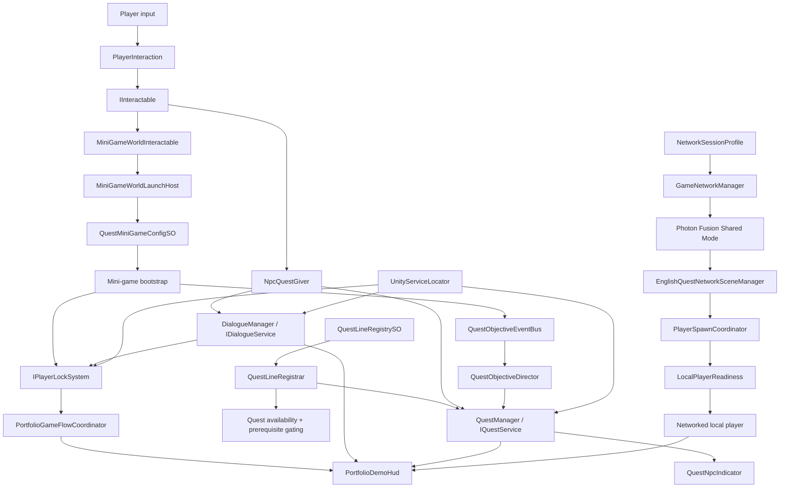

# English Quest Online

English Quest Online is a small Unity portfolio project built to show how an open-world lesson, quest progression, educational mini-games, and lightweight multiplayer can work together as one clean gameplay loop.

It is intentionally small in scope. I did not want to fake a "big game" with filler content. I wanted a compact slice that still shows how I think about architecture, integration, gameplay flow, and presentation when the project needs to stay readable for the next developer.

## Why this prototype exists

This repository is a public-facing technical slice of a much larger educational game direction.

The full production project is already moving beyond this scope, but I cannot share its proprietary content, internal pipelines, or broader implementation details publicly. So instead of hiding that behind vague language, I would rather be direct about what this repository is:

it is a focused portfolio case study.

The goal here was to show how I structure gameplay systems in a way that stays practical, scalable, and easy to reason about:

- a player enters a world and receives lessons through NPCs;
- each NPC owns a quest line with a clear learning purpose;
- each quest line launches a specific mini-game stage;
- each completed mini-game advances the lesson chain through a shared objective pipeline;
- two players can join the same world through Photon Fusion while keeping lesson progression stable and easy to explain.

That makes the project useful in two ways:

- a portfolio-ready technical slice;
- a safe foundation for future expansion into a larger educational experience.

## MVP scope

The current MVP is intentionally narrow:

- one open-world map;
- three NPC-led lessons;
- three integrated educational mini-games;
- two-player Photon Fusion Shared Mode support;
- individual quest progression per player;
- scene-authored UI and prefab-backed presentation.

The slice is fully completable by one player. Multiplayer is here to demonstrate network ownership, spawning, local authority, and shared world presence, not to hold the core learning flow hostage.

## Learning flow

The prototype presents one short lesson chain:

1. **Teacher Ada** introduces the first two letters through a Line Match mini-game.
2. **Coach Ben** unlocks after Ada and reinforces vocabulary through a missing-letter lesson.
3. **Guide Nora** completes the chain with the final word/sentence stage.

Quest lines are authored as data, so unlock order is not hardcoded into the scene. Each line can declare a prerequisite, which keeps the educational flow explicit and reviewable.

## What this project demonstrates technically

- data-driven quest lines with ScriptableObjects;
- NPC gating through prerequisite quest lines;
- shared interaction contract for NPCs and mini-game stations;
- event-driven quest objective progression;
- scene-level composition through a controlled Service Locator boundary;
- player lock and cursor state transitions across open world, dialogue, mini-games, and completion flow;
- scene-authored UI with prefab materialization support instead of runtime-generated HUD magic;
- Photon Fusion Shared Mode setup for two local players;
- player spawning, authority separation, and per-instance camera ownership;
- optional multiplayer presence that does not break solo-first quest progression;
- editor tooling for validation, scene rebuilds, HUD prefab materialization, and content checks.

## Production context

This repository is not meant to represent the full product.

What is intentionally not shown here:

- full production content;
- proprietary world-building assets;
- internal production pipelines;
- the broader live game feature set;
- the complete commercial curriculum and progression structure.

That is deliberate. I wanted this project to be reviewable in a reasonable amount of time while still showing real engineering decisions:

- where data lives;
- how scene composition is controlled;
- how UI is authored;
- how multiplayer is introduced without breaking solo flow;
- how the project stays maintainable as systems start to overlap.

## Core architecture

The project is built around small systems with explicit responsibilities. Runtime objects communicate through:

- interfaces;
- ScriptableObject data;
- event buses;
- limited service resolution at scene/runtime boundaries.

They do not directly reach into each other's internal UI state or hardcode cross-system dependencies.

The most important thing to understand is that the slice is not only "quest + mini-game + multiplayer".
There is also a thin control layer that keeps the whole runtime stable:

- `UnityServiceLocator` resolves scene/runtime contracts without collapsing everything into singletons;
- `PortfolioGameFlowCoordinator` keeps the project in valid states such as open world, dialogue, mini-game, and level completion;
- `IPlayerLockSystem` centralizes input and cursor ownership when gameplay UI takes over;
- `PortfolioDemoHud` is a presentation layer, not the owner of quest logic;
- the Photon boot path hands off to player spawning and local readiness before gameplay starts.

That control layer is what keeps the slice feeling intentional instead of stitched together.

High-level runtime flow:



### Main architectural principles

#### 1. Scene composition stays explicit

The portfolio scene is not built around one giant invisible bootstrap object. The main runtime anchors are visible in the hierarchy:

- `Quest Manager`
- `Quest Line Registrar`
- `Dialogue Manager`
- `Quest Objective Event Bus`
- `Portfolio Demo HUD`
- `Network`

That makes the scene readable for the next developer and keeps debugging practical.

#### 2. Content is authored as data

Quest lines, lessons, mini-game bindings, and dialogue are authored as ScriptableObjects. The scene wires them together, but the content itself does not live inside MonoBehaviours.

#### 3. Mini-games follow a shared lifecycle contract

The three mini-games are different in gameplay, but they now follow the same launch pattern:

- open from an interactable world station;
- lock the player correctly;
- display their own scene-authored UI;
- report completion through the same integration boundary;
- return control cleanly to the open world.

#### 4. UI is scene-driven, not secretly generated

The current direction of the slice is intentional:

- runtime code should not create important HUD structure behind the scenes;
- the main HUD, dialogue panel, and completion panel should exist in the hierarchy;
- visual tuning should happen in the scene or in referenced prefabs;
- editor tooling can materialize prefab assets from the scene, but the scene remains the visual source of truth.

This matters a lot in portfolio work, because presentation tuning should stay editable by hand and not disappear into runtime setup code.

#### 5. Flow control is separated from content logic

Quest lines define what should happen.
Mini-games define how one learning action is played.
The flow coordinator and player lock layer define when control can safely move between:

- world navigation;
- dialogue;
- gameplay UI;
- final completion state.

That separation makes the project much easier to debug and extend.

#### 6. Multiplayer is additive, not foundational

Photon Fusion is integrated as a real system layer, but the slice is still designed to make complete sense in solo mode.

That means:

- multiplayer presence strengthens the prototype;
- it does not explain or compensate for missing single-player behavior;
- the educational quest path stays readable and testable per player.

## Multiplayer model

Networking uses **Photon Fusion 2** in **Shared Mode**.

The current multiplayer slice is deliberately lightweight:

- up to two players join the same open-world scene;
- each player spawns at an authored spawn point;
- each player owns their own movement, input, and camera;
- remote players are visible, replicated, and collide in the world;
- quest progression remains individual per player.

This is not a party-progression model yet. It is a small, intentional multiplayer slice focused on:

- ownership clarity;
- network spawning;
- local authority;
- shared world presence;
- stable solo-first gameplay.

## Project structure

Repository root:

```text
English Quest online/
|-- Assets/
|   |-- _PortfolioSlice/
|   |   |-- Art/
|   |   |-- Demo/
|   |   |-- Docs/
|   |   `-- SourceMirror/
|   |-- Photon/
|   |-- StarterAssets/
|   `-- Settings/
|-- Packages/
`-- ProjectSettings/
```

Active authored slice:

```text
Assets/_PortfolioSlice/
|-- Art/          Gameplay/UI prefabs, materials, and presentation assets
|-- Demo/         Main scene, quest data, scene prefabs, and MVP content
|-- Docs/         Architecture, verification, roadmap, and maintenance docs
`-- SourceMirror/ Runtime/editor/test code mirrored into the slice
```

The current quest-line data is organized per lesson:

```text
Assets/_PortfolioSlice/Demo/Data/QuestLines/
|-- 01_TeacherAda_FirstQuestline/
|-- 02_CoachBen_SecondQuestline/
|-- 03_GuideNora_ThirdQuestline/
`-- Shared_MVP_Catalogs/
```

The main HUD prefab outputs currently live in:

```text
Assets/_PortfolioSlice/Art/Prefabs/UI/PortfolioHUD/
```

## Important scene and tools

Main scene:

```text
Assets/_PortfolioSlice/Demo/Scenes/PortfolioDemo.unity
```

Important editor tools:

- `Tools > Portfolio Demo > Rebuild Test Scene`
- `Tools > English Quest > Docs`
- `Tools > English Quest > UI > Materialize Portfolio HUD Prefabs`

The HUD materializer exists to sync the current scene-authored HUD structure into reusable prefabs and serialized references. It is a support tool, not a replacement for scene-level visual authoring.

## Documentation index

If you are joining the project and want the fastest orientation path, start with:

1. `English Quest online/Assets/_PortfolioSlice/Docs/Architecture.md`
2. `English Quest online/Assets/_PortfolioSlice/Docs/PROJECT_MAP.md`
3. `English Quest online/Assets/_PortfolioSlice/Docs/QuestFlow.md`
4. `English Quest online/Assets/_PortfolioSlice/Docs/Multiplayer.md`
5. `English Quest online/Assets/_PortfolioSlice/Docs/ContentAuthoring.md`
6. `English Quest online/Assets/_PortfolioSlice/Docs/MVP_SENIOR_ROADMAP.md`

For verification and reviewer-facing proof:

- `SoloFirstVerification.md`
- `SoloFirst_Status.md`
- `SoloRuntimeSignoff.md`
- `ManualVerificationChecklist.md`

## Running the project

### Requirements

- Unity `6000.3.3f1`
- Photon Fusion App ID configured in:

```text
Assets/Photon/Fusion/Resources/PhotonAppSettings.asset
```

### Single-player verification

1. Open `Assets/_PortfolioSlice/Demo/Scenes/PortfolioDemo.unity`
2. Enter Play Mode
3. Let the local player spawn
4. Complete the full Ada -> Ben -> Nora lesson chain

### Two-player verification

1. Enable Unity Multiplayer Play Mode
2. Open `Window > Multiplayer > Play Mode Scenarios`
3. Configure the main editor plus one additional editor instance
4. Use `PortfolioDemo` as the start scene
5. Run the scenario and verify separate spawn points, cameras, movement, and independent quest progression

## Prototype boundaries

This repository intentionally does not try to solve everything.

Included:

- a complete small educational quest loop;
- clean scene composition;
- mini-game integration;
- optional two-player multiplayer presence;
- editor-side validation and presentation tooling.

Out of scope for the current slice:

- production backend persistence;
- shared co-op quest ownership;
- full live-service UX;
- large-scale content authoring pipeline;
- complete production environment art;
- full curriculum breadth.

## Further development path

The next steps are not about spraying more content across the project. They are about making the existing slice stronger, safer, and more polished.

### 1. Strengthen the authoring pipeline

- finish validator coverage for scene references and runtime contracts;
- make quest-line authoring even safer through higher-level build specs and automated checks;
- reduce opportunities for broken inspector wiring.

### 2. Expand automated confidence

- add stricter tests around progression, unlock chains, multiplayer spawning, and state transitions;
- increase Play Mode validation for the full lesson flow;
- treat regression prevention as part of the product, not a side task.

### 3. Improve portfolio presentation quality

- finalize the visual language of the HUD, dialogue, completion, and mini-game panels;
- tighten typography, spacing, transitions, and feedback moments;
- make the slice feel as polished as the underlying architecture already is.

### 4. Deepen multiplayer intentionally

- add more readable shared moments that do not break solo-first logic;
- optionally add synchronized lightweight world interactions;
- keep lesson ownership clear while increasing the sense of co-presence.

### 5. Prepare the path toward production-scale content

- keep scene-level authoring explicit;
- preserve data-driven content structure;
- avoid reintroducing hidden runtime UI generation or tightly coupled scene logic;
- expand through systems that remain inspectable and maintainable by the next developer.

## Closing note

This project is small by design, but it is not meant to feel disposable.

The value of the slice is that it demonstrates judgment:

- what to include;
- what to cut;
- what to keep data-driven;
- what to expose in the scene;
- what to validate automatically;
- and how to present multiplayer and quest systems in a way that remains understandable to another developer.

That is the real purpose of this repository: not to look large, but to show solid judgment in a small, inspectable slice.
